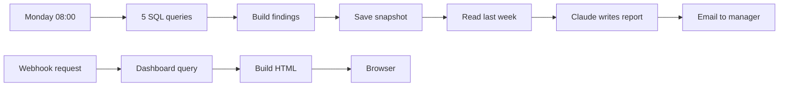

# CRM Hygiene Agent

A weekly job that checks a CRM for problems nobody has time to look for, writes a short report about what it found, and serves a live dashboard.

Built as a portfolio project. The company, people and data are fictional; see [Test data](#test-data).


---

## The problem

CRM data rots quietly. Duplicate contacts pile up, deals stop moving without anyone noticing, records arrive with no lead source so nobody can tell which campaign paid for them. Checking for this by hand is boring, so it never gets done, and after a year the reports built on that data stop being trusted.

## What it does

Every Monday at 08:00, with nobody at their desk:

1. Five SQL queries run against the CRM data: duplicates, incomplete records, stale deals, the pipeline funnel, and broken deal records.
2. The results are collected and every total and percentage is computed in code.
3. This week's key numbers are written to a snapshot table, and last week's are read back.
4. Claude turns the findings into a short report, leading with whatever changed most.
5. The report is emailed to the sales manager.

A separate webhook serves a dashboard on demand, with the same numbers plus a six-week history.



## What the report looks like

Actual output from a test run, unedited:

> Stale deals and their value have grown the most: 7 deals worth EUR 258,000 are stuck, up from 4 deals worth EUR 140,000 last week.
>
> **Pipeline at risk**
> Ben Fischer holds 5 of the 7 stale deals, worth EUR 181,000, with one deal untouched for 121 days. He should review and update these deals this week.
>
> **Data quality**
> Duplicate contacts have increased from 1 group to 2, including a 3-way duplicate for Lisa Hartmann split between Ben Fischer and Chris Lang. Merge these records to avoid double outreach.

---

## Design decisions

**SQL for the numbers, the model only for the writing.**
Every figure in the report comes from a query. Totals and percentages are calculated in a code node before the model sees anything, so the model never does arithmetic and cannot produce a confident wrong number. Its prompt forbids inventing or estimating figures.

**Why a database instead of querying the CRM directly.**
A CRM has no query language. Joining deals to contacts, grouping by owner, or comparing this week to last week means pulling every record through the API and rebuilding the logic by hand each time. A database does it in one statement, and it can store history. This is the same warehouse pattern RevOps teams use with BigQuery or Snowflake; Supabase is the free version of it.

**Snapshots are what make the report worth reading.**
Without history every report reads identically. The snapshot table turns "7 stale deals" into "up from 4 last week", which is the part a manager reacts to.

**Fixed metrics, not a model that decides what to check.**
An agent writing its own queries each week would produce a differently shaped report every time, and nothing could be compared. The metrics are defined once; the agent decides what to lead with and how to phrase it.

**The dashboard is secondary on purpose.**
Dashboards get built and then nobody opens them. The report goes to the person whether or not they remember the URL. The dashboard is there for when they want to dig.

---

## Results

The test dataset contains 15 deliberately planted data-quality problems (documented in `test-data/planted_problems.md`). The queries found all 15:

| Check | Found |
|---|---|
| Duplicate contacts | 2 groups, including one person with 3 records, 3 email addresses and 2 different owners |
| Incomplete contacts | 10 of 32: missing company, missing lead source, invalid email, never touched |
| Stale deals | 7 open deals worth EUR 258,000 with no activity for 30+ days |
| Owner concentration | 5 of the 7 stale deals belong to one rep, worth EUR 181,000 |
| Broken deal records | 4: no owner, no amount, orphaned contact link, open 6+ months |

Every number in the generated report was checked against the underlying data. No invented figures across test runs.

**One thing worth noting about the model.** It reads individual numbers reliably, but when summarising several at once it initially claimed three metrics "held steady" when one had changed. The fix was a prompt rule to compare field by field rather than in groups. Accuracy at the level of one number is not the same as accuracy across a set of them.

## Limitations

- **Mock data, not a live CRM sync.** The sync path is designed but the dataset is loaded directly, so every planted problem survives. A real CRM rejects malformed emails at the source, which would remove some of the test cases.
- **The dashboard webhook has no authentication.** Anyone with the URL can see it. Production would need header auth.
- **SSL verification is disabled** on the database connection because the n8n instance does not trust Supabase's certificate authority. The connection is still encrypted. The correct fix is loading the CA certificate.
- **The model exceeds its stated word limit** by 10 to 20 percent. LLMs cannot count words reliably.
- **Small dataset.** 32 contacts and 22 deals is enough to prove the logic, not to claim anything about performance at scale.

## Next steps

- Live sync from the CRM on a schedule, with incremental updates instead of a full refresh
- Send to Slack as well as email
- Alert immediately when a metric crosses a threshold, rather than waiting for Monday
- A fuzzy duplicate pass: SQL narrows the field to suspicious pairs, the model judges only those

---

## Stack

n8n · Supabase (Postgres) · Claude Haiku 4.5 via the n8n AI Agent · Gmail

## Repository

```
workflow/    n8n workflow, credentials removed
sql/         schema and the seven queries, one file each
test-data/   mock contacts and deals, plus the list of planted problems
```

## Setup

1. Create a Supabase project and run `sql/00_schema.sql`.
2. Import `test-data/mock_contacts.csv` and `mock_deals.csv` into the `contacts` and `deals` tables, then run the `update` statement at the bottom of the schema file to fill `email_domain`.
3. Import `workflow/crm_hygiene_agent.json` into n8n and add credentials: Postgres, Anthropic, Gmail.
4. For the Postgres credential use Supabase's **session pooler** connection details, not the direct connection. The direct host is IPv6-only and most hosted n8n instances cannot reach it. The user includes the project reference (`postgres.<project-ref>`).
5. Replace the example address in the email node.
6. Activate the workflow, then open the webhook production URL to see the dashboard.

## Authorship

I designed the checks, wrote the SQL, defined the data model and built the workflow. JavaScript in the code nodes was written with Claude's help.
