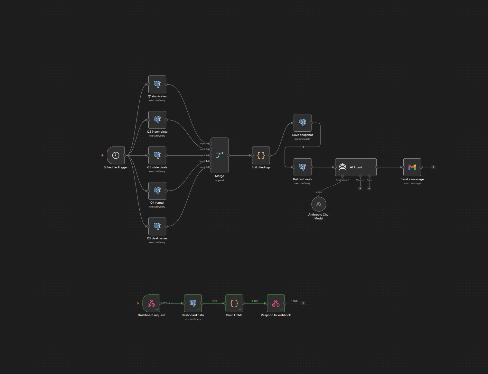
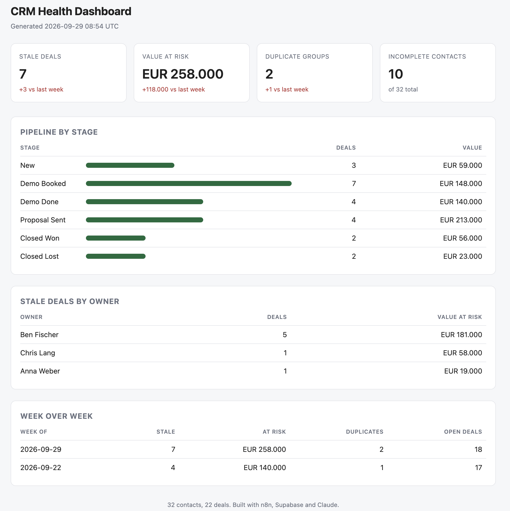

# CRM Hygiene Agent

An [n8n](https://n8n.io) workflow that automatically audits CRM data quality every week, writes an AI-generated summary report, emails it out, and serves a live dashboard on demand.



## Dashboard



## What it does

**Weekly run (every Monday at 08:00):**
1. Runs five Postgres checks against the CRM database in parallel:
   - Duplicate records
   - Incomplete records (missing required fields)
   - Stale deals (no recent activity)
   - Funnel/stage distribution
   - Deal data issues
2. Merges the results and builds a structured findings summary (Code node).
3. Saves a snapshot of the findings for week-over-week comparison.
4. Pulls last week's snapshot for trend context.
5. An AI agent (Anthropic Claude via `lmChatAnthropic`) writes a human-readable report from the findings + trend data.
6. Emails the report via Gmail.

**On-demand dashboard:**
- A webhook endpoint (`Dashboard request`) triggers a fresh Postgres query (`Dashboard data`), builds an HTML view (`Build HTML`), and responds directly to the webhook caller — giving a live hygiene dashboard without waiting for the weekly cycle.

## Workflow structure

```
Every Monday 08:00
  ├─ Q1 duplicates ─┐
  ├─ Q2 incomplete ─┤
  ├─ Q3 stale deals ─┼─ Merge ─ Build findings ─ Save snapshot ─ Get last week ─ Write report (AI) ─ Email the report
  ├─ Q4 funnel ──────┤                                                              │
  └─ Q5 deal issues ─┘                                                    Anthropic Chat Model

Dashboard request (webhook) ─ Dashboard data ─ Build HTML ─ Respond to Webhook
```

## Requirements

- n8n instance (self-hosted or cloud)
- Postgres connection with access to the CRM database
- Gmail credentials (OAuth2) for sending the weekly report
- Anthropic API credentials for the report-writing agent

## Setup

1. Import `crm_hygiene_agent.json` into n8n (**Workflows → Import from File**).
2. Configure credentials for the Postgres, Gmail, and Anthropic nodes.
3. Adjust the five SQL queries (`Q1`–`Q5`) to match your CRM schema.
4. Activate the workflow.
5. (Optional) Expose the `Dashboard request` webhook URL wherever you want the live dashboard to be reachable.

## Files

- `crm_hygiene_agent.json` — the full n8n workflow export (nodes, connections, and settings).
